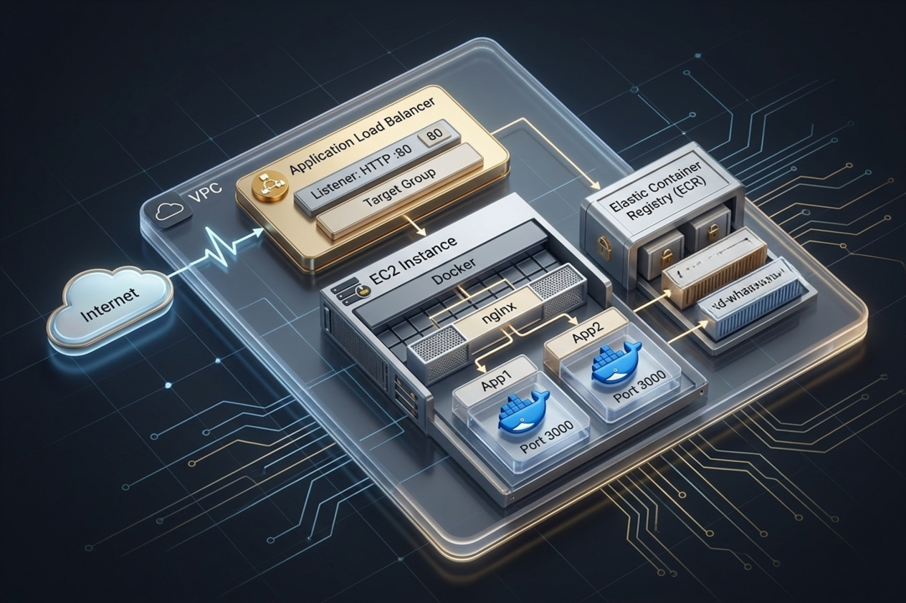
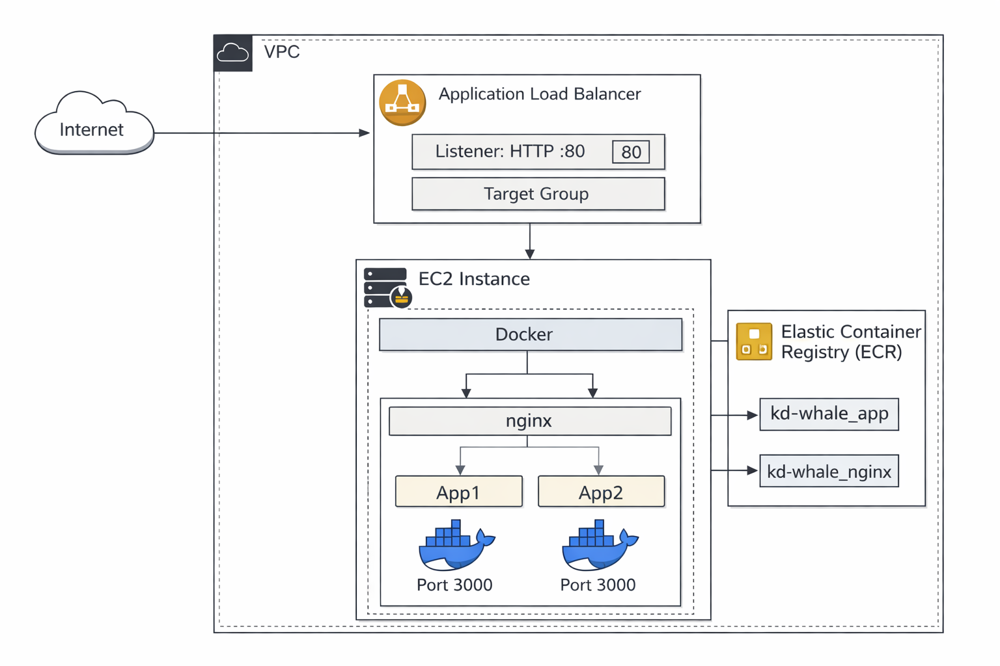
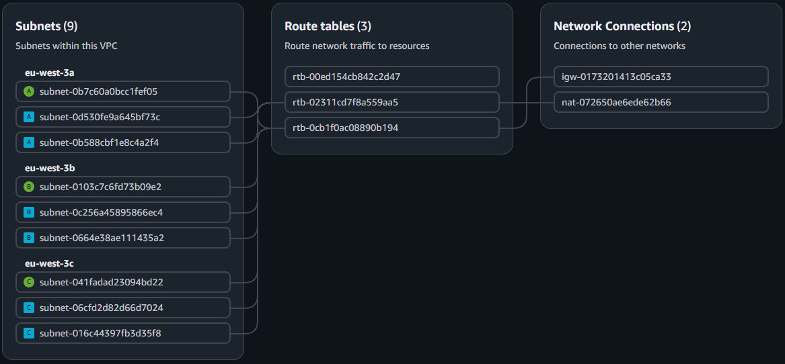

<a id="readme-top"></a>

[![LinkedIn][linkedin-shield]][linkedin-url]

<br />
<div align="center">
  <h3 align="center">Whale App – DevOps Project</h3>


  <p align="center">
    Dockerized Node.js application deployed on AWS using Terraform
  </p>
</div>



<details>
  <summary>Table of Contents</summary>
  <ol>
    <li><a href="#about-the-project">About The Project</a></li>
    <li><a href="#built-with">Built With</a></li>
    <li><a href="#getting-started">Getting Started</a></li>
    <li><a href="#usage">Usage</a></li>
    <li><a href="#aws-deployment">AWS Deployment</a></li>
    <li><a href="#roadmap">Roadmap</a></li>
    <li><a href="#contact">Contact</a></li>
  </ol>
</details>

## About The Project

This project demonstrates a real-world DevOps setup using:

- Infrastructure as Code (Terraform)
- Containerized backend (Docker)
- Reverse proxy (Nginx)
- AWS cloud deployment

The goal is to showcase how an application stack can be built, containerized, and deployed.

## Built With

- Node.js (Express)
- Docker
- Docker Compose
- Nginx
- Terraform
- AWS (EC2, ALB, ECR, IAM)

## Getting Started

### Prerequisites

- Docker
- Docker Compose
- Terraform
- AWS CLI (configured)

### Installation (VM – Ubuntu)

1. Clone the repository

```bash
git clone https://github.com/KovyD20/whale-app
cd whale-app
```

2. Start the application

```bash
cd nginx
docker-compose up --build
```

What does it do?  
Starts the application and reverse proxy in Docker containers .

Command breakdown:
- docker-compose → manages multiple containers
- up → starts services
- --build → rebuilds images before starting

## Usage

```
http://localhost:PORT
```

⚠️ Replace PORT with the value defined in docker-compose.yml.

## AWS Deployment

### Init

```bash
cd terraform
terraform init
```

What does it do?  
Downloads required Terraform providers.

### Plan

```bash
terraform plan
```

What does it do?  
Shows what infrastructure will be created.

### Apply

```bash
terraform apply
```

What does it do?  
Creates the AWS resources.

⚠️ Important:
- AWS credentials required (~/.aws/credentials)
- Region: eu-west-3

<p>
  
</p>

<p>
  
</p>

## Roadmap

- [ ] Automated testing
- [ ] CI/CD pipeline
- [ ] HTTPS
- [ ] Monitoring
- [ ] Kubernetes deployment

## Contact

Daniel Koevy - (Kövy Dániel) 

GitHub: https://github.com/KovyD20

LinkedIn: <https://www.linkedin.com/in/d%C3%A1niel-k%C3%B6vy-62129b324/>

E-mail: kovy.d20@gmail.com

[linkedin-shield]: https://img.shields.io/badge/-LinkedIn-black.svg?style=for-the-badge&logo=linkedin
[linkedin-url]: https://www.linkedin.com/in/d%C3%A1niel-k%C3%B6vy-62129b324/
